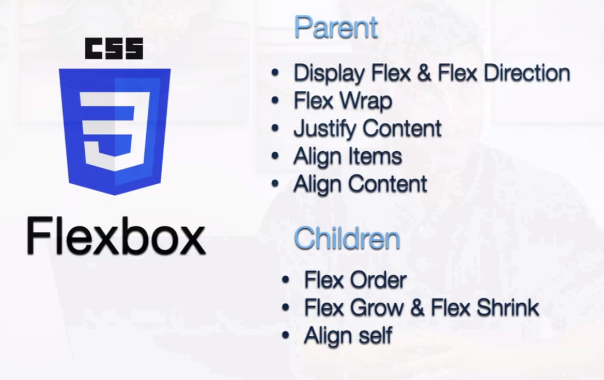

# All notes, covered HERE !
___ so proud ___
# M1B2
## Flex Box 


## EMMET shortcuts,
``` 
h1{FLEXbOX}+(section#ID>h2{Properties of flex congainer}>(.flex-container)*6)*2
```

# M2B1
## Modul Patterns:- AMD (asynchronous module defiition), UMD (universal module deifinition) and CommonJS (popular Node.js ecosystem)

To export sayHi function in sayHi.js

To import and use sayHi function in main.js


# M2B2
Learn how to use communication and cross-cultural knowledge as tools when conflicts arise in working relationships.
Understand how to communicate across cultures, using empathy and curiosity and actively questioning own biases.
Understand that respect is the foundation of strong relationship-building with teammates.